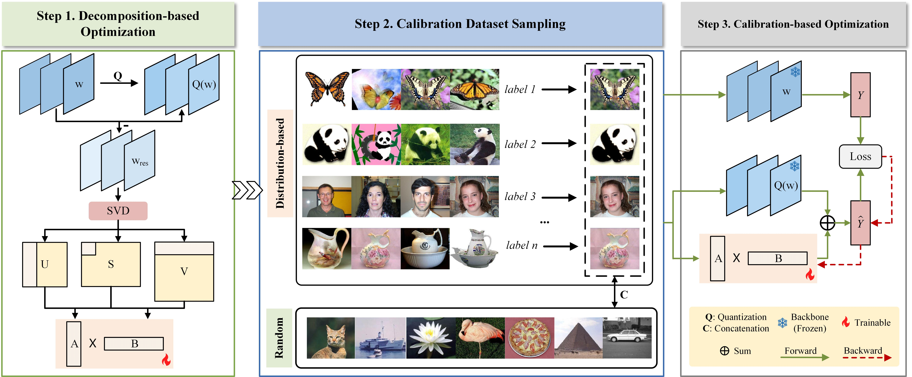

# OQFV

Source code of "OQFV: Optimized Quantization-Aware Fine-tuning for 2-bit Visual Transformer-based Model".



# Requirements

Python  3.8

torch 2.4.1

torchvision 0.19.1

transformers 4.46.2

# Datasets

To download the datasets, please refer to [VTAB-1K](https://huggingface.co/datasets?search=vtab-1k). Then move the dataset folders to `<YOUR PATH>/OQFV/dataset/vtab-1k/`

# Model

Download the [ViT-B/16](https://huggingface.co/google/vit-base-patch16-224-in21k) to `<YOUR PATH>/OQFV/model/vit_base_patch16_224_in21k`

# Run

Train&Evaluation

```
bash train_vit.sh
```

### Natural

| Method       | Cifar100 | Caltech101 | DTD      | Flower102 | Pets     | SVHN     | Sun397   | Average  |
| ------------ | -------- | ---------- | -------- | --------- | -------- | -------- | -------- | -------- |
| PEFT Methods |          |            |          |           |          |          |          |          |
| BitFit       | 72.8     | 87         | 59.2     | 97.5      | 85.3     | 59.9     | 51.4     | 73.3     |
| VPT-Shallow  | 77.7     | 86.9       | 62.6     | 97.5      | 87.3     | 74.5     | 51.2     | 76.8     |
| VPT-Deep     | 78.8     | 90.8       | 65.8     | 98        | 88.3     | 78.1     | 49.6     | 78.5     |
| LoRA         | 61.1     | 93.3       | 69.3     | 98.9      | 90.9     | 82.1     | 48.1     | 77.7     |
| QAF Methods  |          |            |          |           |          |          |          |          |
| QLoRA        | 21.7     | 66.1       | 55.3     | 84.7      | 52.5     | 76.4     | 14.9     | 53.1     |
| LoftQ        | 32.3     | 87.7       | 62.9     | 95.3      | 86.5     | 85.4     | 28.4     | 68.4     |
| **OQFV**     | **40.7** | **88.6**   | **64.5** | **96.3**  | **86.7** | **85.6** | **34.8** | **71.0** |

### Specialized

| Method       | Camelyon | EuroSAT  | Resisc45 | Retinopathy | Average  |
| ------------ | -------- | -------- | -------- | ----------- | -------- |
| PEFT Methods |          |          |          |             |          |
| BitFit       | 78.7     | 91.6     | 72.9     | 69.8        | 78.3     |
| VPT-Shallow  | 78.2     | 92       | 75.6     | 72.9        | 79.7     |
| VPT-Deep     | 81.8     | 96.1     | 83.4     | 68.4        | 82.4     |
| LoRA         | 82.9     | 95.4     | 85.0     | 69.8        | 83.3     |
| QAF Methods  |          |          |          |             |          |
| QLoRA        | 77.4     | 93.2     | 73.5     | 68.9        | 78.3     |
| LoftQ        | 78.6     | 94.2     | 79.8     | 70.3        | 80.7     |
| **OQFV**     | **79.5** | **94.7** | **81.2** | **70.7**    | **81.5** |

### Structured

| Method       | Clevr-Count | Clevr-Dist | DMLab    | KITTI-Dist | dSpr-Loc | dSpr-Ori | sNORB-Azim | sNORB-Ele | Average  |
| ------------ | ----------- | ---------- | -------- | ---------- | -------- | -------- | ---------- | --------- | -------- |
| PEFT Methods |             |            |          |            |          |          |            |           |          |
| BitFit       | 61.5        | 55.6       | 32.4     | 55.9       | 66.6     | 40       | 15.7       | 25.1      | 44.1     |
| VPT-Shallow  | 50.5        | 58.6       | 40.5     | 67.1       | 68.7     | 36.1     | 20.2       | 34.1      | 47.0     |
| VPT-Deep     | 68.5        | 60         | 46.5     | 72.8       | 73.6     | 47.9     | 32.9       | 37.8      | 55.0     |
| LoRA         | 80.9        | 63.7       | 48.6     | 78.3       | 78.1     | 47.6     | 28.7       | 33.5      | 57.4     |
| QAF Methods  |             |            |          |            |          |          |            |           |          |
| QLoRA        | 72.6        | 62.0       | 38.2     | 64.3       | 65.5     | 43.3     | 26.8       | 34.1      | 50.9     |
| LoftQ        | 68.8        | 62.2       | 44.8     | 76.2       | 74.6     | 43.8     | 30.4       | 30.5      | 53.9     |
| **OQFV**     | **75.2**    | **62.3**   | **45.1** | **76.4**   | **74.6** | **44.3** | **32.3**   | **34.5**  | **55.6** |

# Acknowledgments

Part of the code is borrowed from [binary_adapter](https://github.com/JieShibo/PETL-ViT/tree/main/binary_adapter) and [LoftQ](https://github.com/yxli2123/LoftQ).